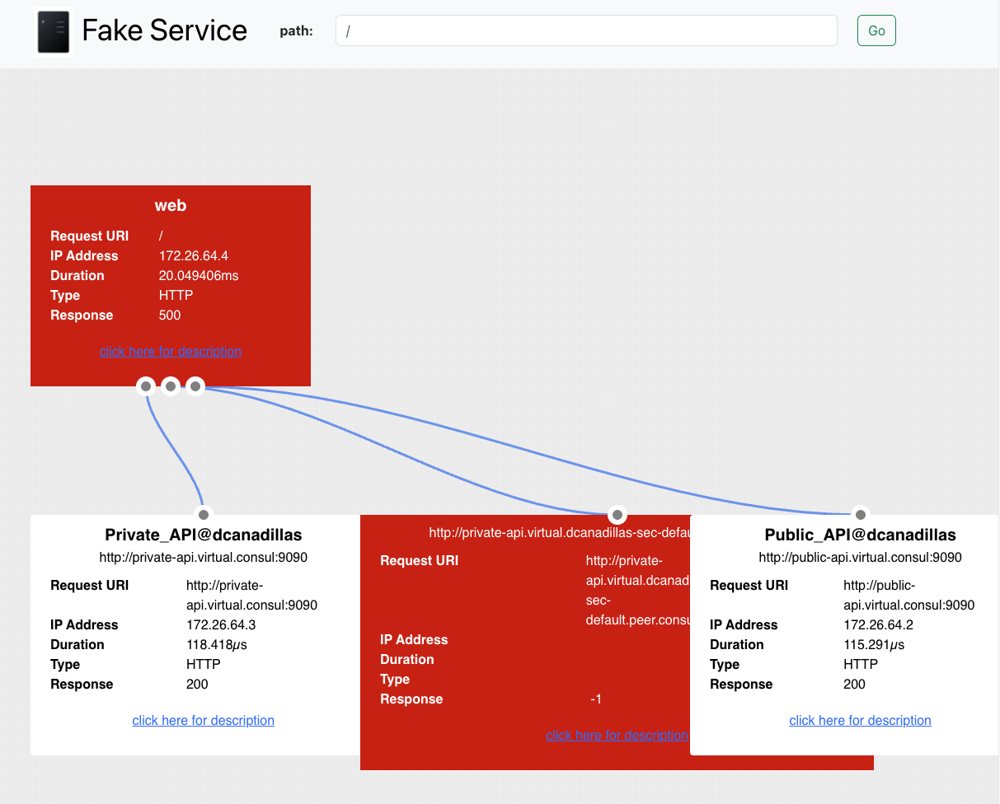
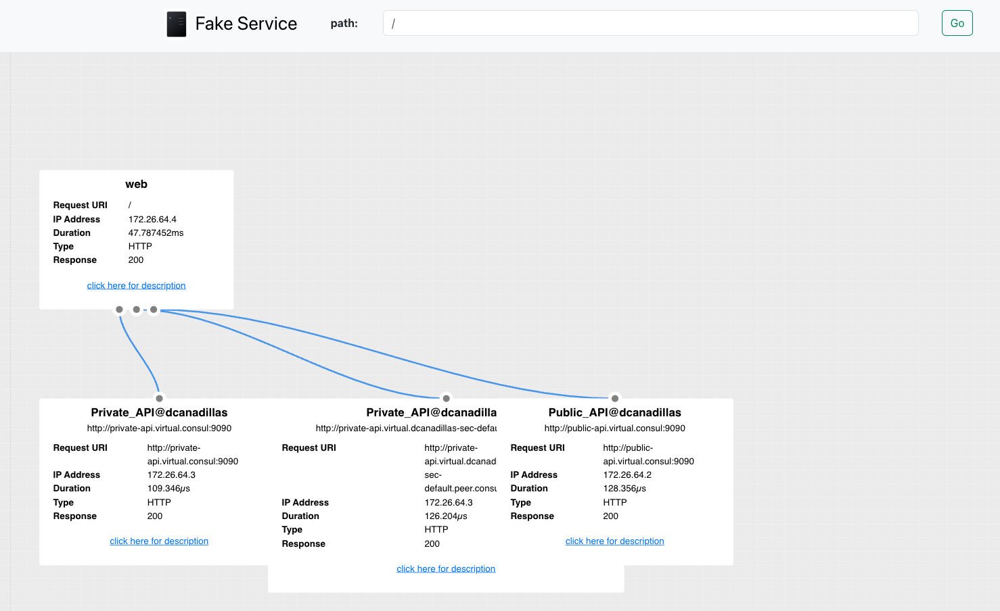
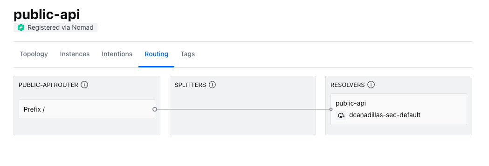
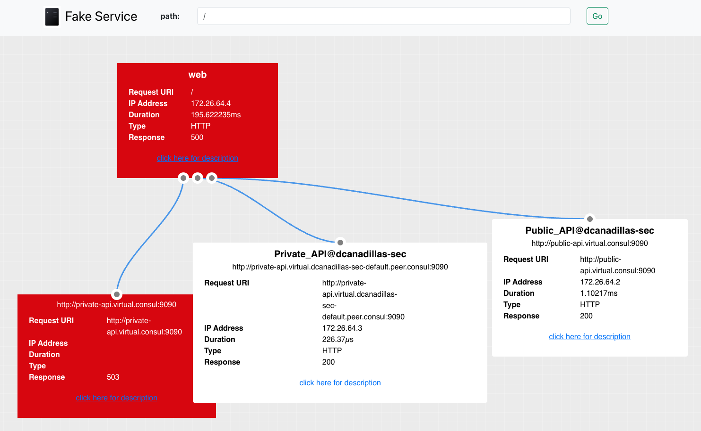

# Nomad and Consul Service Mesh with Peered Clusters and Failover

This repository contains some demo assets and steps to configure Nomad and Consul to peer two clusters, deploy some dummy services with Nomad, and configure a failover scenario to see how that works with Consul service mesh. 

## Requirements

* A Linux/MacOS terminal with some CLI skills
* Two Nomad and Consul clusters (for demo peering and failover). If you don't have the clusters available we are including a link to a Terraform configuration to deploy your clusters in GCP
  * The requirements for this is detailed in the [repo Readme](https://github.com/dcanadillas/consul-nomad-gcp#requirements)
* [Consul CLI](https://releases.hashicorp.com/consul/) binary installed
* [Nomad CLI](https://releases.hashicorp.com/nomad/) binary installed

> NOTE: You can deploy your own clusters in VMs using any virtualization local platform like Multipass, VirtualBox or any KVM/QEMU based solution. We recommend anyway to use the Terraform configuration referenced in this repo to deploy your clusters in GCP, as all these repo steps have been tested with that deployment. 


## Deploy your cluster

> NOTE: If you have already you Consul and Nomad clusters running you can skip this section. But bear in mind that you need at least Consul ACLs enabled to work with [Nomad Workload Identities](https://developer.hashicorp.com/nomad/docs/integrations/consul/acl#nomad-workload-identities)

### Deploy two clusters in GCP with Terraform

I have prepared a Terraform configuration to deploy Nomad and Consul in Google Cloud Platform, which is in [here]().

To deploy both clusters you can do it by following the next steps:
1. Create a directory to work with:
   ```bash
   mkdir $HOME/consul-nomad-peering
   ```
2. Clone the repository and get into the folder:
   ```bash
   git clone https://github.com/dcanadillas/consul-nomad-gcp $HOME/consul-nomad-peering/consul-nomad-gcp
   cd $HOME/consul-nomad-peering/consul-nomad-gcp
   ```
3. Follow the instructions to [build the Packer image](https://github.com/dcanadillas/consul-nomad-gcp#build-image) first from the repo
4. Create the first cluster by using Terraform. Start with setting the variables:
   ```bash
   tee terraform.auto.dc1.tfvars << EOF
   gcp_region = "europe-southwest1"
   gcp_project = "<your_gcp_project>"
   gcp_instance = "n2-standard-2"
   numnodes = 3
   numclients = 2
   # One of the names that you should see from "gcloud iam service-accounts list --format="table(NAME)""
   gcp_sa = "<your_gcp_service_accont>"
   cluster_name = "dcanadillas"
   owner = "dcanadillas"
   consul_license = "<your_Consul_license_string>"
   nomad_license = "<your_Nomad_license_string>"
   dns_zone = "<use_this_variable_if_you_have_a_dns_zone>"
   consul_bootstrap_token = "Consul43v3r"
   EOF
   ```
   And deploy your TF config:
   ```bash
   terraform init
   terraform apply -var-file terraform.auto.dc1.tfvars
   ```
5. Once that Terraform finishes you can connect to the cluster using the Terraform output variables:
   ```bash
   eval $(terraform output -r eval_vars)
   nomad status
   consul members
   ```
6. Open a new Terminal (or terminal tab) for the second cluster deployment and execute similar steps than before, but creating a different `.tfvars` file and using a different Terraform workspace to deploy the new infrastructure:
   ```bash
   cd $HOME/consul-nomad-peering/consul-nomad-gcp
   
   tee terraform.auto.dc2.tfvars << EOF
   gcp_region = "europe-west1"
   gcp_project = "<your_gcp_project>"
   gcp_instance = "n2-standard-2"
   numnodes = 3
   numclients = 1
   # One of the names that you should see from "gcloud iam service-accounts list --format="table(NAME)""
   gcp_sa = "<your_gcp_service_accont>"
   cluster_name = "dcanadillas"
   owner = "dcanadillas-sec"
   consul_license = "<your_Consul_license_string>"
   nomad_license = "<your_Nomad_license_string>"
   dns_zone = "<use_this_variable_if_you_have_a_dns_zone>"
   consul_bootstrap_token = "Consul43v3r"
   EOF

   terraform workspace new secondary

   terraform init

   terraform apply -var-file terraform.auto.dc2.tfvars
   ```
7. In this other terminal load the environment variables for the second cluster:
   ```bash
   eval $(terraform output -raw eval_vars)
   nomad status
   consul members
   ```

> NOTE: If you use HCP Terraform you can easily deploy the two clusters in different workspaces without the need of creating two different variable files and not managing the Terraform states locally.

At this point you should have two different clusters where you are connected to Consul and Nomad, with two differente terminals (or tabs) connected to each of the clusters.

Now, clone this repo content and change to its directoy to continue to deploy the environment demo use case:

```bash
git clone https://github.com/dcanadillas/consul-nomad-peering $HOME/consul-nomad-peering/demo-assets
cd $HOME/consul-nomad-peering/demo-assets
```

## Configure Nomad clusters

In both clusters we want to configure the workload identity configuration. From Nomad we can achieve by executing the following:
```bash
nomad setup consul -y
```
> **IMPORTANT**: Previous command needs to be executed from both clusters, so do it from both terminals you configured before.

Nomad namespace for the API gateway. We will create only in the first `dcanadillas` cluster a namespace for the API Gateway:
```bash
nomad namespace apply \
  -description "namespace for Consul API Gateways" \
  ingress
```

And a binding rule to apply automatically the right policy:
```bash
consul acl binding-rule create \
    -method 'nomad-workloads' \
    -description 'Nomad API gateway' \
    -bind-type 'templated-policy' \
    -bind-name 'builtin/api-gateway' \
    -bind-vars 'Name=${value.nomad_job_id}' \
    -selector '"nomad_service" not in value and value.nomad_namespace==ingress'
```


## Deploy Demo Application

Let's deploy first the Consul configurations for the applications (when doing peering, do it in all clusters):
```bash
consul config write configs/proxy-defaults.hcl
```

Deploying backend services in one Nomad DC (the first `dcanadillas` one). For the backend services let's deploy 2 replicas per service, so we can also see in Nomad how the workloads are spread:
```bash
nomad run -var datacenter=dcanadillas -var public_replicas=2 -var private_replicas=2 demo-fake-service/backend.nomad.hcl
nomad run -var datacenter=dcanadillas demo-fake-service/frontend.nomad.hcl
```

Let's configure intentions to make connectivity between front and back work in that cluster (`dcanadillas`):
```bash
consul config write configs/private-api-intentions.hcl
consul config write configs/public-api-intentions.hcl
```

Check that the front service is able to reach backend services:
```bash
nomad exec -task web -t -i $(nomad job status -json front-service | jq -r .[].Allocations[0].ID) curl localhost:9090
```

## Deploying the API Gateway
Let's deploy the API Gateway we have defined in the first cluster `dcanadillas`:
```bash
nomad run api-gw.nomad.hcl
```

We deploy the `listener` for the API Gateway and the `httpRoute` route traffic to the `front-service` (everything in the same first cluster where the API Gateway is deployed):
```bash
consul config write listener.hcl
consul config write httproute.hcl
```

And we need to enable the intention from the API Gateway to the frontend service:
```bash
consul config write configs/front-intentions.hcl
```

Now we should be able to reach the external API Gateway address.

If you used the Terraform configuration, we deployed a load balancer to communicate to the API Gateway backends. You can get the external IP of the Load Balancer from an output in your Terraform (in this case in the first workspace execution):
```bash
terraform output apigw_load_balancers
```

Load the following url in browser: `http://<api_gw_load_balancer_ip>:8080/ui`. 

You will notice your services deployed and the working connections:
* Your `front-service` service can connect to  `private-api` and `public-api` in the same cluster
* `front-service` cannot communicate to `private-api` in the second cluster



## Use case with services in peered cluster

In case we want to show routing between different clusters with Cluster Peering, we will deploy the backend services in the second cluster, then deploy a Mesh Gateway per cluster in Nomad and establish the Consul peering.

Let's configure first the specific Consul and Nomad parameters to connect to the second clusters:
```bash
export CONSUL_HTTP_ADDR="<second_cluster_consul_addr>"
export CONSUL_HTTP_TOKEN="<second_cluster_consul_token>"
export CONSUL_HTTP_SSL_VERIFY=false
export NOMAD_ADDR="<second_cluster_nomad_addr>"
export NOMAD_TOKEN="<second_cluster_nomad_token>"
```

Now, let's deploy the backend services in the second cluster `dcanadillas-sec`. In this case we deploy only one replica per service:
```bash
nomad run -var datacenter=dcanadillas-sec \
 -var public_replicas=1 \
 -var private_replicas=1 \
 demo-fake-service/backend.nomad.hcl
```

### Configuring policies for the Mesh Gateways

We need to do this in all peered clusters where deploying the Mesh Gateways.

Let's create first the policy:
```bash
consul acl policy create -name mesh-gateway \
-description "Policy for the Mesh Gateways" \
-rules @./peering/mesh-acl.hcl
```

Create the Consul role, associating the policy created:
```bash
consul acl role create -name mesh-gateway-role \
-description "A role for the MGW policies" \
-policy-name mesh-gateway
```

Add the binding rule:
```bash
consul acl binding-rule create \
-method nomad-workloads \
-bind-type role \
-bind-name mesh-gateway-role \
-selector 'value.nomad_service=="mesh-gateway"' 
```


```bash
consul config write -http-addr <first_consul_cluster_addr> peering/mesh.hcl
consul config write -http-addr <secondary_consul_cluster_addr> peering/mesh.hcl
```

Let's deploy the Mesh Gateways in both clusters. We are going to use one Mesh Gateway job definition to deploy to both clusters, because we are using an attribute from the Nomad client to assing the tagged address in Consul. We are using GCP deployment example, so the attribute called `unique.platform.gce.network.<gcp_network>.external-ip.0` is used to assing the WAN address of the mesh gateway. When we deployed the Terraform configuration, the network name where the clusters are deployed is `<datacenter>-network`, so we can deploy the mesh gateway for each cluster as follows:

* First on the first `dcanadillas` Nomad datacenter:
  ```bash
  nomad run -var datacenter=dcanadillas peering/mesh-gateway.hcl
  ```

* Then on the second `dcanadillas-sec` cluster:
  ```bash
  nomad run -var datacenter=dcanadillas-sec peering/mesh-gateway.hcl
  ```

Now we can configure the peering from the steps defined [here](./peering/README.md).


## Exposing services from the second cluster to the first one

Our example will connect the frontend in the following manner:
* Frontend (DC1) --> Public API (DC1)
* Frontend (DC1) --> Private API (DC1)
* Frontend (DC1) --> Private API (DC2)

Because our clusters are peered (default partition in DC1 to default partition in DC2), we should be able to route traffic from the Frontend service to the Private API service in the second cluster, just by using its virtual address `private-api.virtual.<name_of_peer>.peer.consul`. To do that we need first to export the service `private-api` from DC2 (we called it `dcanadillas-sec`) to DC1 (`dcanadillas`). This is done by executing the following in the second Consul cluster (`dcanadillas-sec`):
```bash
consul config write peering/default-exported.hcl
```

You should see the exported services from the `dcanadillas-sec` cluster:
```bash
$ consul services exported-services
Service      Partition  Namespace  Consumer Peers       Consumer Partitions
private-api  default    default    dcanadillas-default
public-api   default    default    dcanadillas-default
```

And now we need to create the intentions to allow traffic from the `front-service` in `dcanadillas` cluster (DC1) to `private-api` in `dcanadillas-sec` (DC2). This is executed in the second `dcanadillas-sec` cluster:
```bash
consul config write peering/private-api-intentions.hcl
```

Check int the `dcanadillas` cluster that the `private-api` service is reachable from the `front-service` in its peered partition:
```bash
$ nomad exec -task web -t -i $(nomad job status -json front-service | jq -r .[].Allocations[0].ID) curl private-api.virtual.dcanadillas-sec-default.peer.consul
{
  "name": "Private_API@dcanadillas-sec",
  "uri": "/",
  "type": "HTTP",
  "ip_addresses": [
    "172.26.64.6"
  ],
  "start_time": "2025-04-29T15:22:27.365802",
  "end_time": "2025-04-29T15:22:27.365914",
  "duration": "112.018µs",
  "body": "Hello World from Private API",
  "code": 200
}
```
> NOTE: If you receive a communication error from the mesh gateways, you need to check that the right policies are applied to both clusters and restart/redeploy the mesh gateways to check that policies are attached correctly to the Consul service token applied from the Nomad workload identity.

If we reload the load balancer url of the API Gateway again (`http://<api_gw_load_balancer_ip>:8080/ui`) we will see that there are not red boxes, as all services can communicate between each other, including the `private-api` call in the secondary cluster from `front-service` in the first cluster. Cluster peering routing is working.




## Configuring failover with Service Resolvers:
We will configure a failover for the `public-api` service in the first cluster.

```bash
consul config write peering/public-api-resolver.hcl
```

And create the new intention **in the second cluster**:
```bash
consul config write peering/public-api-intentions.hcl
```

You can check in Consul UI in the first `dcanadillas` cluster that there is a Failover configured fo the peered cluster. If you go to `https://<CONSUL_HTTP_ADDR>//ui/dcanadillas/services/public-api/routing` in a browser, you will see the failover:



You can also check the failover configuration in the Consul discovery chain:
```
$ curl -ks $CONSUL_HTTP_ADDR/v1/discovery-chain/public-api -H "X-Consul-Token: $CONSUL_HTTP_TOKEN" | jq .Chain.Nodes
{
  "resolver:public-api.default.default.dcanadillas": {
    "Type": "resolver",
    "Name": "public-api.default.default.dcanadillas",
    "Resolver": {
      "ConnectTimeout": "15s",
      "Target": "public-api.default.default.dcanadillas",
      "Failover": {
        "Targets": [
          "public-api.default.default.external.dcanadillas-sec-default"
        ]
      }
    }
  }
}
```

If you delete the Nomad job from the first cluster:
```bash
nomad stop -purge backend-services
```

You can check that you only lost connectivity with `private-api`, but not with `public-api`, because the failover is redirecting to the `public-api` in the peered cluster.



Recover the Nomad job for `backend-services` in the first cluster:
```bash
nomad run -var datacenter=dcanadillas demo-fake-service/backend.nomad.hcl
```

And if you load the API Gateway url again you will find that services back to the initial connectivity.

## Configure failover with Sameness Groups

In this case we will do automatic failover just by defining [Consul Sameness Groups](https://developer.hashicorp.com/consul/docs/reference/config-entry/sameness-group). 
> NOTE: We need to delete the previous failover resolver and modify the intentions.

Delete the failover that we created before from the first `dcanadillas` cluster:
```bash
consul config delete -filename peering/public-api-resolver.hcl
```

You can check now that there is no failover in the discovery chain:
```
$ curl -ks $CONSUL_HTTP_ADDR/v1/discovery-chain/public-api -H "X-Consul-Token: $CONSUL_HTTP_TOKEN" | jq '.Chain.Nodes'
{
  "resolver:public-api.default.default.dcanadillas": {
    "Type": "resolver",
    "Name": "public-api.default.default.dcanadillas",
    "Resolver": {
      "ConnectTimeout": "5s",
      "Default": true,
      "Target": "public-api.default.default.dcanadillas"
    }
  }
}
```

Deploy the Sameness Groups in cluster DC1 (`dcanadillas`):
```bash
consul config write peering/sameness-groups/sg-dc1.hcl
```

And in cluster DC2 (`dcanadillas-sec`):
```bash
consul config write peering/sameness-groups/sg-dc2.hcl
```

If you check the discovery chain, now you will see that the failover configuration is configured for your services to failover to the `dcanadillas-sec-default` peer:
```
$ curl -ks $CONSUL_HTTP_ADDR/v1/discovery-chain/public-api -H "X-Consul-Token: $CONSUL_HTTP_TOKEN" | jq '.Chain.Nodes'
{
  "resolver:public-api.default.default.dcanadillas": {
    "Type": "resolver",
    "Name": "public-api.default.default.dcanadillas",
    "Resolver": {
      "ConnectTimeout": "5s",
      "Target": "public-api.default.default.dcanadillas",
      "Failover": {
        "Targets": [
          "public-api.default.default.external.dcanadillas-sec-default"
        ]
      }
    }
  }
}

 $ curl -ks $CONSUL_HTTP_ADDR/v1/discovery-chain/private-api -H "X-Consul-Token: $CONSUL_HTTP_TOKEN" | jq '.Chain.Nodes'
{
  "resolver:private-api.default.default.dcanadillas": {
    "Type": "resolver",
    "Name": "private-api.default.default.dcanadillas",
    "Resolver": {
      "ConnectTimeout": "5s",
      "Target": "private-api.default.default.dcanadillas",
      "Failover": {
        "Targets": [
          "private-api.default.default.external.dcanadillas-sec-default"
        ]
      }
    }
  }
}
```

Now, we can control the failover services authorization with Consul intentions. So, if we want to allow the failover again for the `public-api` service in the second cluster (`dcanadillas-sec`), we need to modify the intention to allow connectivity from the sameness group (remember to execute this command to the second cluster):
```bash
consul config write peering/sameness-groups/public-api-intentions-sg.hcl
```

Check again that the service is failing over if you delete the `backend-service` job from the first cluster:
```bash
nomad stop -purge backend-services
```

If you check the API Gateway again you will see that the `front-service` is able to communicate to all failovered services in the second cluster.

## (Optional and WIP...) Configure the Terminating Gateway

Let's configure first the ACLs needed by the Terminating Gateways. For that, we will create a Consul policy associated with a Consul role, and then a binding rule for the auth method created by Nomad Workload Identity configuration. With this configuration, every time that we deploy a `terminating-gateway` service, the right policy should be attached.

Create first the policy. We included a policy in this repo to allow the Terminating Gateway to work with a demo example service called `tls-destination`:
```bash
consul acl policy create -name terminating-gateway \
-description "Policy for the Terminating Gateways" \
-rules @./configs/terminating-acl.hcl
```

Create the Consul role, associating the policy created:
```bash
consul acl role create -name terminating-gateway-role \
-description "A role for the TGW policies" \
-policy-name terminating-gateway
```

Add the binding rule:
```bash
consul acl binding-rule create \
-method nomad-workloads \
-bind-type role \
-bind-name terminating-gateway \
-selector 'value.nomad_service=="terminating-gateway"' 
```

Now it is time to deploy the Terminating Gateway:
```bash
nomad run ./tgw.nomad.hcl
```

